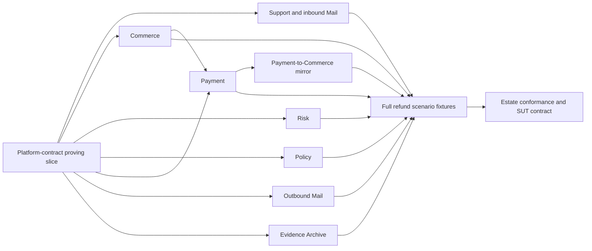

# Enterprise digital twins implementation programme

The numbered plans below are technical increments within refund Release 1,
not separate business releases. Supplier onboarding is future Release 2.

Status: Approved design split into executable plans  
Date: 2026-08-19  
Design: [Enterprise digital twins for refund workflows](../specs/2026-08-19-enterprise-digital-twins-design.md)

## Purpose

The approved design covers independent systems with separate data ownership and
failure behaviour. Implementation is therefore split into plans that can be
built, tested, and reviewed without loading the whole estate into one change.
The plans share public contracts, but no business twin imports another twin's
models or repository code.

## Plan order

| Order | Plan | Independently testable result |
|---:|---|---|
| 1 | [Platform-contract proving slice](2026-08-19-platform-contract-proving-slice.md) | Identity, CRM, Control, and Event Relay run in Compose and prove the shared contracts |
| 2 | Support and inbound Mail | A customer request becomes a ticket through the permitted Mail integration, with scoped views and append-only audits |
| 3 | Commerce | Orders, fulfilment, buyer snapshots, and payment mirrors expose versioned evidence without refund logic |
| 4 | Risk | Restricted signals and 403 field enforcement work under evaluator and support personas |
| 5 | Policy | Immutable policy revisions, effective-time lookup, retention, and mid-case publication work under virtual time |
| 6 | Payment | Charge reads, asynchronous refunds, balance reservation, receipts, retries, and uncertain-outcome recovery work without policy decisions |
| 7 | Outbound Mail | Submission, virtual-time delivery states, bounces, deferrals, and drops work without deciding message content |
| 8 | Evidence Archive | Packages accept versioned entries, seal once, reject mutation, and expose auditor history |
| 9 | Payment-to-Commerce mirror | Signed private events update Commerce transaction mirrors and tolerate duplicate or reordered delivery |
| 10 | Full refund fixtures | All named scenarios load deterministically with 50 customers, 100 orders, aliases, and cross-system checksums |
| 11 | Estate conformance and SUT contract | The three reference commands prove manual success, failure behaviour, scenario coverage, and exported evidence |

## Planning rule for subsequent systems

Write each plan immediately before its implementation. It must consume the
released contracts from the proving slice, state every new endpoint and event
schema, and include its own black-box command. Contract changes require a
separate change to the approved design and proving-slice conformance suite.

No plan may move case state, eligibility decisions, approval routing, customer
explanation, or workflow completion into a twin.

## Release gates

| Gate | Required evidence |
|---|---|
| Per-task | Focused failing test, minimal implementation, focused passing test, lint and type checks, commit |
| Per-plan | Contract tests and a black-box proof against running containers |
| Cross-system | Only documented integrations, signed events, duplicate handling, and source-resource reconciliation |
| Estate | The acceptance criteria in the approved design and no database access from public tests |
