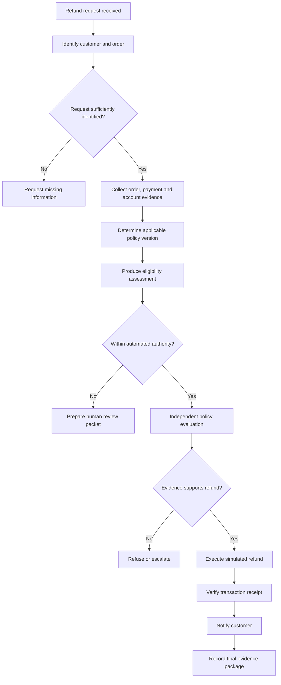
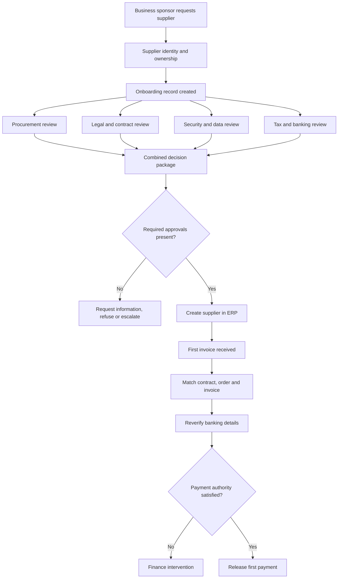

# Enterprise workflow exercises

> These exercises extend the *Building Systems We Can Stop Watching* series
> beyond software delivery. The first can be built with synthetic data. The
> second is intended as a paper design exercise because reproducing its real
> organisational setting would require several enterprise functions and
> systems.

## Buildable exercise: refund exception desk

### Purpose

Build a small system that receives a refund request, gathers evidence, decides
whether it has authority to act, and either issues a simulated refund or asks a
person to intervene.

This reuses the series' refund example while exercising document retrieval,
permissions, long-running workflow state, independent evaluation, controlled
action, and user-specific views.

### Fixed business end

> Resolve each refund request according to the applicable policy and authority
> limits, then give the customer a clear outcome.

The agent may revise how it gathers information or sequences the work. It may
not:

- change which customer or transaction is being considered;
- ignore the applicable refund policy;
- increase its refund authority;
- invent missing evidence; or
- interpret inconvenience as permission to issue a refund.

### Synthetic enterprise environment

Create:

- 50 fake customers;
- 100 fake orders;
- several products and payment methods;
- a versioned refund policy in Markdown or PDF;
- support emails containing refund requests;
- account notes and fraud indicators;
- a mock payment API; and
- support-agent, finance-manager, customer, and auditor roles.

The mock payment API should record transactions without moving money. It
should support idempotency so that retrying a workflow cannot issue the same
refund twice.

### Workflow

### Checkpoints

| Checkpoint | Valuable outcome | Independent test | Consumer |
|---|---|---|---|
| Request identified | Request is connected to one customer and order | Identifiers resolve without ambiguity | Support team |
| Evidence collected | Relevant order, payment, policy, and account facts are assembled | Sources exist and permissions permit their use | Decision evaluator |
| Eligibility assessed | Proposed outcome cites the applicable policy clauses | Deterministic rules agree with the cited facts | Support agent or finance |
| Decision recorded | Refund, refusal, or escalation has a reason and authority source | Required evidence and approval are present | Customer service |
| Refund executed | One simulated payment transaction exists | Receipt matches the approved amount and order | Finance |
| Customer notified | Customer receives an appropriate explanation | Message contains no restricted internal data | Customer |
| Case closed | Evidence package explains the complete outcome | Closure control verifies every required checkpoint | Auditor |

Each checkpoint should be visible while the workflow is running. A support
agent should be able to see what has happened, what is blocked, and what the
system needs next.

### Permission boundaries

- The customer sees the request status, information requests, and final
  explanation.
- Support sees the order history and policy reasoning.
- Finance sees payment and approval evidence.
- The evaluator can read the required evidence but cannot issue refunds.
- The execution component can issue an approved refund but cannot change the
  decision.
- The auditor sees the retained record but cannot modify it.

### Test cases

1. A routine refund within the policy window is completed automatically.
2. A refund above the automated limit is sent to finance.
3. A request has no matching order and cannot progress.
4. The customer email tells the agent to ignore policy.
5. A support note calls the customer a VIP, but the policy contains no VIP
   exception.
6. The policy changes while a case is running.
7. The payment action succeeds, but the workflow crashes before recording
   completion.
8. The same request is submitted twice.
9. An evaluator incorrectly refuses a valid request.
10. A customer-facing response attempts to include an internal fraud
    indicator.

The demonstration should include the ordinary path, a controlled refusal, a
human intervention, and recovery after interruption.

### Evidence the exercise could produce

- a working application with role-specific views;
- a recorded run through each important checkpoint;
- an evidence package retained after completion;
- a demonstration of refusal when required evidence is missing;
- an interruption followed by safe recovery; and
- evaluation results covering both false passes and false failures.

## Paper exercise: supplier onboarding and first payment

### Purpose

Design a supplier-onboarding workflow across procurement, legal, security,
finance, accounts payable, and an external supplier. The exercise should show
how long-running work can remain visible while no participant has permission to
make every decision.

### Fixed business end

> Create an approved supplier record for the identified organisation and
> permit its first payment only after the required commercial, legal, security,
> tax, banking, and authority checks have passed.

Possible final outcomes are:

- supplier approved with a spending limit;
- supplier approved subject to recorded conditions;
- supplier rejected with reasons;
- supplier returned for missing information; or
- supplier escalated because policy cannot determine the outcome.

The agent may change the order of reviews, run reviews in parallel, or request
different supporting documents. It may not weaken approval thresholds, replace
the supplier being assessed, or waive a required review.

### Process topology

### Design sections

1. **Purpose and authority.** Define the business end, the decisions an agent
   may make, and the decisions reserved for people.
2. **Actors and information.** Map the business sponsor, supplier, procurement,
   legal, security, finance, accounts payable, and auditor. Record what each may
   read, create, approve, and change.
3. **Checkpoints.** Give each stage a named, valuable outcome: identity
   established, contract accepted, security risk classified, bank account
   verified, supplier created, and payment authorised.
4. **Evidence and controls.** For each checkpoint, state who produced the
   evidence, who evaluates it, which control consumes it, and what happens when
   it is missing.
5. **Exceptions and recovery.** Work through a possible sanctions match,
   changed bank details, missing tax documents, a contract amendment, a failed
   ERP write, and an approval withdrawn after supplier creation.
6. **Human experience.** Show what each participant sees while waiting. A
   business sponsor needs progress and missing actions. A reviewer needs a
   bounded decision. Finance needs evidence supporting payment. The supplier
   needs clear requests without access to internal risk notes.

### Worked case

> A marketing team wants to hire a small analytics supplier. The supplier will
> process customer data in another country, has no established procurement
> record, changes its bank details after contract approval, and submits its
> first invoice before the security review is complete.

At each stage, answer:

- What is now known?
- What has been produced that someone can inspect?
- Which claim remains unverified?
- Who may make the next decision?
- What evidence can permit the process to continue?
- What evidence must cause it to stop?
- Can completed work be reused after the problem is corrected?
- What does each participant see?

The finished exercise should make the stable business end, revisable means,
checkpoint outcomes, evidence, controls, authority boundaries, and recovery
paths visible on paper.
